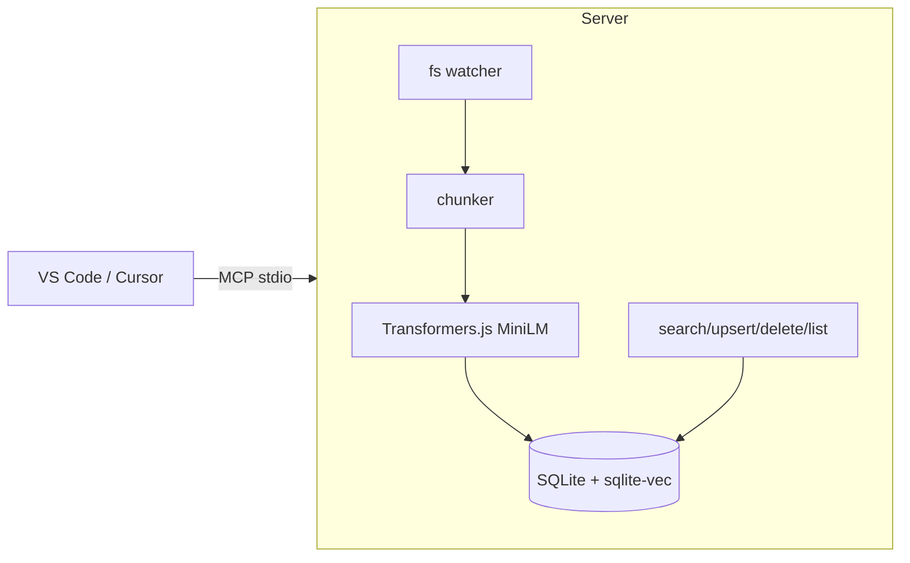

# PocketMCP

here’s a tight, copy-pasteable README you can drop into a fresh repo. i’m calling the project **PocketMCP** (lightweight, local, runs great on an Intel N100). I also listed a few alternate names at the end.

---

# PocketMCP

A tiny, local-first **MCP server** that:

* **Watches a folder**, chunks & embeds files, and stores vectors in **SQLite + sqlite-vec**
* Exposes **semantic search** as MCP tools (+ resource URIs for exact chunks)
* **Works offline** using **Transformers.js** with `all-MiniLM-L6-v2` embeddings
* Integrates with **VS Code** and **Cursor**

> Designed for small machines (e.g., Intel N100, 16 GB RAM). Zero external services.

---

## Architecture (short)

* **MCP Server (TypeScript)**
  Runs over stdio. Tools: `search`, `upsert_documents`, `delete_documents`, `list_documents`. Resource: `mcp+doc://<doc_id>#<chunk_id>` returns exact chunk text.

* **Embeddings (local, JS)**
  `@huggingface/transformers` feature-extraction pipeline with `Xenova/all-MiniLM-L6-v2` → 384-dim sentence vectors (mean-pooled, L2-normalized).

* **Vector Store (embedded)**
  **SQLite + sqlite-vec** virtual table `vec0(embedding FLOAT[384])` with metadata columns for `doc_id`, `chunk_id`, offsets, and an aux `text` column.

* **Ingestion**
  `chokidar` watcher on a source directory → on add/change: read → **chunk (\~1000 tokens, 120 overlap)** → embed → upsert. On delete: remove doc’s chunks.



---

## Requirements

* Node 18+ (or 20+ recommended), pnpm or npm
* SQLite; `sqlite-vec` extension (installed via npm module)
* First run will download model weights to local cache (then fully offline)

---

## Quickstart

```bash
# 1) Scaffold
git init pocketmcp && cd pocketmcp
# (paste this README as README.md)

# 2) Install
pnpm init -y
pnpm add @modelcontextprotocol/sdk @huggingface/transformers better-sqlite3 sqlite-vec chokidar fast-glob p-limit zod dotenv
pnpm add -D typescript tsx @types/node

# 3) Make folders
mkdir -p src data kb

# 4) Env (optional)
cat > .env << 'EOF'
SQLITE_PATH=./data/index.db
WATCH_DIR=./kb
MODEL_ID=Xenova/all-MiniLM-L6-v2
CHUNK_SIZE=1000
CHUNK_OVERLAP=120
EOF
```

Add minimal `package.json` scripts:

```json
{
  "scripts": {
    "dev": "tsx src/server.ts",
    "build": "tsc -p .",
    "start": "node dist/server.js"
  }
}
```

---

## VS Code / Cursor integration

**Cursor** → Settings → MCP → Add server:

* Command: `pnpm`
* Args: `dev`
* Env: (from `.env` or set `MODEL_ID`, `SQLITE_PATH`, `WATCH_DIR`)

**VS Code** (clients that support MCP `mcpServers`):

```json
{
  "mcpServers": {
    "pocketmcp": {
      "command": "pnpm",
      "args": ["dev"],
      "env": {
        "SQLITE_PATH": "./data/index.db",
        "WATCH_DIR": "./kb",
        "MODEL_ID": "Xenova/all-MiniLM-L6-v2"
      }
    }
  }
}
```

---

## Tool interface (MCP)

* `search({ query: string, top_k?: number, filter?: { doc_ids?: string[], source?: string } })`

  * Returns `{ matches: [{ chunk_id, doc_id, score, preview, resource }] }`
* `upsert_documents({ docs?: [{ text, external_id?, metadata? }] })`
* `delete_documents({ doc_ids?: string[], external_ids?: string[] })`
* `list_documents({ page?: { limit?: number, cursor?: string } })`
* **Resource**: `mcp+doc://<doc_id>#<chunk_id>` → `{ text, doc_id, chunk_id, metadata }`

---

## Project layout

```
src/
  server.ts           # MCP wiring (tools + resource)
  db.ts               # SQLite init (WAL, sqlite-vec load, schema)
  embeddings.ts       # Transformers.js MiniLM pipeline
  chunker.ts          # ~1000 token chunks, 120 overlap
  ingest.ts           # raw upsert helpers
  file-ingest.ts      # file -> text -> chunks -> vectors -> DB
  watcher.ts          # chokidar + debounce + concurrency
data/                 # index.db lives here
kb/                   # your source folder to watch
```

---

## Configuration (env)

* `SQLITE_PATH` (default `./data/index.db`)
* `WATCH_DIR` (enable auto-ingest if set)
* `MODEL_ID` (`Xenova/all-MiniLM-L6-v2`)
* `CHUNK_SIZE` (default 1000) / `CHUNK_OVERLAP` (default 120)

---

## Limits & expectations

* Great for **\~10k–100k chunks** on a single DB file.
* Typical **query latency**: sub-100 ms for `top_k<=10` on modest corpora.
* Memory: MiniLM model is small (\~100MB class); stays well within 16 GB.

