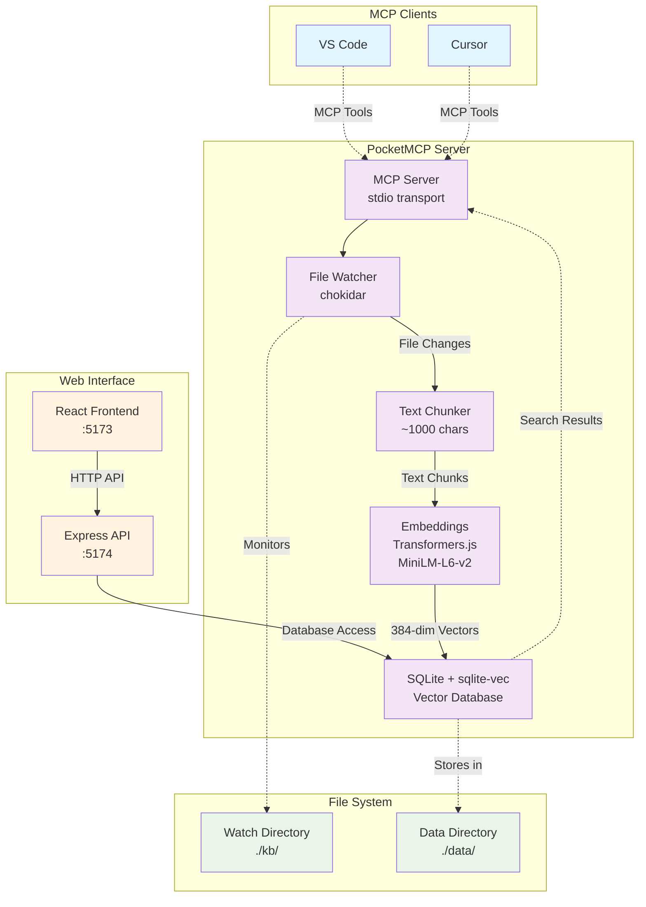
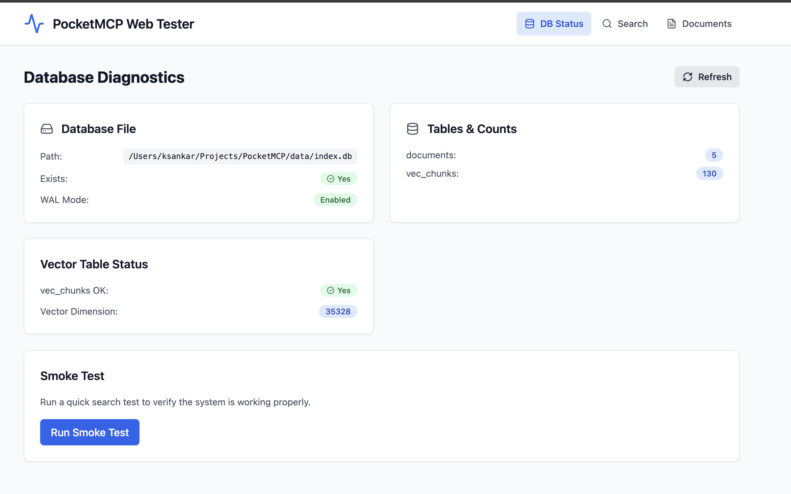
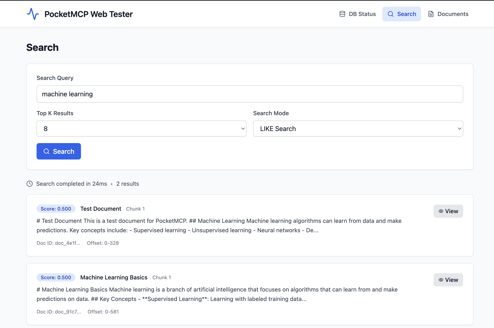
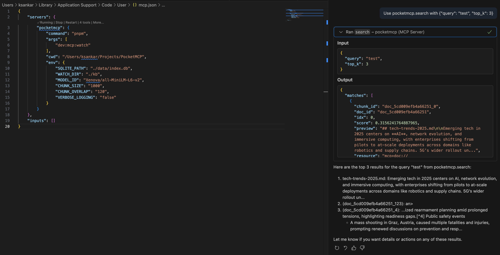
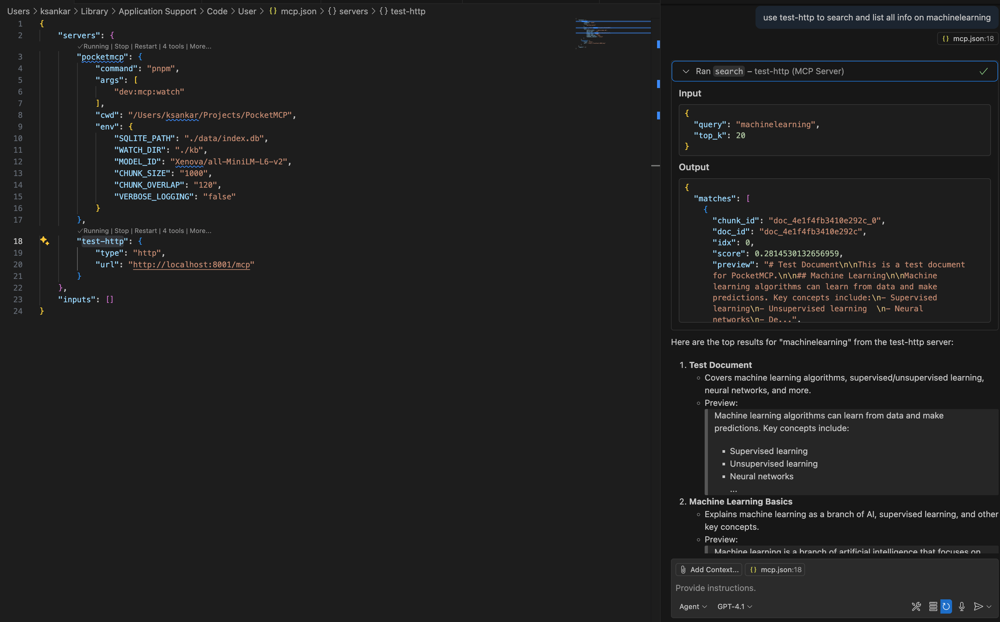

# PocketMCP

**PocketMCP** is a lightweight, local-first MCP (Model Context Protocol) server that automatically watches folders, chunks and embeds files locally using Transformers.js with MiniLM, stores vectors in SQLite + sqlite-vec, and exposes semantic search capabilities to VS Code and Cursor. Designed for small machines (I'm running on an Intel N100 with 16GB RAM) with zero external dependencies after initial model download.

## 🌟 Features

- **🔍 Semantic Search**: Find content by meaning, not just keywords
- **📁 Auto-Ingestion**: Watches folders and automatically processes new/changed files
- **📄 Multi-Format Support**: PDF, DOCX, Markdown, and plain text files
- **⚡ Local-First**: Runs completely offline after initial model download
- **🗄️ SQLite Storage**: Fast, reliable vector storage with sqlite-vec extension
- **🔧 MCP Integration**: Native support for VS Code and Cursor via MCP protocol
- **🌐 Web Interface**: Built-in web tester for validation and manual testing
- **💾 Efficient**: Designed for resource-constrained environments
- **🔄 Real-time**: Debounced file watching with smart concurrency limits
- **📊 Smart Segmentation**: Page-aware PDF processing and section-aware DOCX handling
- **🛡️ Robust Error Handling**: Graceful handling of encrypted, corrupted, or oversized files

## 🏗️ Architecture



## 📊 Performance & Limits

- **Sweet spot**: 10K-100K chunks on modest hardware
- **Query latency**: Sub-100ms for `top_k <= 10` on typical corpora
- **Memory usage**: ~100MB for model + minimal overhead per document
- **Concurrency**: Limited to 3 simultaneous file operations by default
- **File size limit**: 50MB per file (configurable)

## Screenshots






## 📋 Table of Contents

- [Features](#-features)
- [Architecture](#️-architecture)
- [Performance & Limits](#-performance--limits)
- [Quick Start](#-quick-start)
- [Web Tester](#-web-tester)
- [MCP Client Integration](#-mcp-client-integration)
- [API Reference](#-api-reference)
- [Configuration](#️-configuration)
- [Development](#️-development)
- [Deployment](#-deployment-1)
- [Troubleshooting](#-troubleshooting)

## 🚀 Quick Start

### 1. Installation

```bash
# Clone or download the project
cd PocketMCP

# Install dependencies
pnpm install

# Setup environment
pnpm setup
# Or manually: cp .env.sample .env
```

### 2. Configuration

Edit `.env` file:

```bash
# SQLite database path
SQLITE_PATH=./data/index.db

# Directory to watch for file changes (optional)
WATCH_DIR=./kb

# Embedding model (default is recommended)
MODEL_ID=Xenova/all-MiniLM-L6-v2

# Chunking configuration
CHUNK_SIZE=1000
CHUNK_OVERLAP=120
```

### 3. Create Content Directory

```bash
# Create directory for your documents
mkdir -p kb

# Add some markdown or text files
echo "# My First Document" > kb/test.md
echo "This is a sample document for testing PocketMCP." >> kb/test.md
```

### 4. Start the Server

```bash
# Development - MCP server + web interface
pnpm dev

# Production - MCP server only
pnpm build && pnpm start
```

On first run, the server will download the MiniLM model (~100MB) and then process any files in your watch directory.

## 🌐 Web Tester

PocketMCP includes a comprehensive web interface for testing and validation.

### Access Points

- **Web Interface**: http://127.0.0.1:5173
- **API Server**: http://127.0.0.1:5174
- **Health Check**: http://127.0.0.1:5174/health

### Features

#### 📊 Database Diagnostics Panel
- Real-time database status monitoring
- Table counts and vector dimensions
- SQLite WAL mode verification
- Error detection and reporting
- One-click smoke testing

#### 🔍 Search Panel
- Interactive semantic search testing
- LIKE vs Vector search modes
- Configurable result count (top-K)
- Detailed result inspection
- Performance metrics (response time)

#### 📄 Documents Panel
- Browse all indexed documents
- Pagination support
- Document metadata display
- Creation and update timestamps

#### 🔎 Chunk Viewer
- Detailed chunk inspection modal
- Full text content display
- Metadata and offset information
- Copy-to-clipboard functionality

### API Endpoints

| Endpoint | Method | Description |
|----------|--------|-------------|
| `/health` | GET | Server health check |
| `/api/db/diag` | GET | Database diagnostics |
| `/api/search` | POST | Semantic search |
| `/api/chunk/:id` | GET | Get specific chunk |
| `/api/docs` | GET | List documents |

### Example API Usage

**Search Documents:**
```bash
curl -X POST http://127.0.0.1:5174/api/search \
  -H "Content-Type: application/json" \
  -d '{"query": "machine learning", "top_k": 5, "mode": "like"}'
```

**Get Diagnostics:**
```bash
curl http://127.0.0.1:5174/api/db/diag | jq .
```

## 🔧 MCP Client Integration

### Cursor Integration

1. Open **Cursor Settings** → **MCP**
2. Add a new server:

```json
{
  "command": "pnpm",
  "args": ["dev:mcp"],
  "cwd": "/path/to/PocketMCP",
  "env": {
    "TRANSPORT": "stdio",
    "SQLITE_PATH": "./data/index.db",
    "WATCH_DIR": "./kb"
  }
}
```

### VS Code Integration

Add to your MCP settings:

```json
{
  "mcpServers": {
    "pocketmcp": {
      "command": "pnpm",
      "args": ["dev:mcp"],
      "cwd": "/path/to/PocketMCP",
      "env": {
        "TRANSPORT": "stdio",
        "SQLITE_PATH": "./data/index.db",
        "WATCH_DIR": "./kb"
      }
    }
  }
}
```

### HTTP Transport (Web Clients)

For web clients or remote access:

```json
{
  "mcpServers": {
    "pocketmcp": {
      "transport": "http",
      "url": "http://localhost:8001/mcp"
    }
  }
}
```

## 📚 API Reference

### MCP Tools

#### `search`
Search for similar content using semantic search.

```json
{
  "query": "machine learning algorithms",
  "top_k": 5,
  "filter": {
    "doc_ids": ["doc_123", "doc_456"]
  }
}
```

#### `upsert_documents`
Insert or update documents programmatically.

```json
{
  "docs": [
    {
      "text": "Your document content here...",
      "external_id": "my_doc_1",
      "title": "Important Notes",
      "metadata": {}
    }
  ]
}
```

#### `delete_documents`
Delete documents by ID.

```json
{
  "doc_ids": ["doc_123"],
  "external_ids": ["my_doc_1"]
}
```

#### `list_documents`
List all documents with pagination.

```json
{
  "page": {
    "limit": 20
  }
}
```

### MCP Resources

PocketMCP provides resource URIs for accessing specific chunks:

- **Format**: `mcp+doc://<doc_id>#<chunk_id>`
- **Returns**: Complete chunk data including text, offsets, and metadata

## ⚙️ Configuration

### Environment Variables

| Variable | Default | Description |
|----------|---------|-------------|
| `SQLITE_PATH` | `./data/index.db` | Path to SQLite database file |
| `WATCH_DIR` | (none) | Directory to watch for file changes |
| `MODEL_ID` | `Xenova/all-MiniLM-L6-v2` | Hugging Face model for embeddings |
| `CHUNK_SIZE` | `1000` | Target chunk size in characters |
| `CHUNK_OVERLAP` | `120` | Overlap between chunks in characters |
| `PDF_MAX_PAGES` | `300` | Maximum pages to process in PDF files |
| `PDF_MIN_TEXT_CHARS` | `500` | Minimum text characters required in PDFs |
| `DOC_MAX_BYTES` | `10000000` | Maximum file size for DOCX files (10MB) |
| `DOCX_SPLIT_ON_HEADINGS` | `false` | Split DOCX documents on headings (h1/h2) |
| `NODE_ENV` | `development` | Environment mode |
| `VERBOSE_LOGGING` | `false` | Enable detailed logs |
| `DEBUG_DOTENV` | `false` | Enable dotenv debug output |
| `API_PORT` | `5174` | Web API server port |
| `API_BIND` | `127.0.0.1` | API server bind address |
| `TRANSPORT` | `both` | MCP transport mode (stdio/http/both) |
| `HTTP_HOST` | `0.0.0.0` | HTTP server bind address |
| `HTTP_PORT` | `8001` | MCP server port |
| `LOG_LEVEL` | `info` | Logging level (debug/info/warn/error) |

### Available Scripts

| Script | Description |
|--------|-------------|
| `pnpm dev` | Start web interface + API server for testing |
| `pnpm dev:mcp` | Start MCP server (both transports + file watching) |
| `pnpm build` | Build all components |
| `pnpm start` | Start production MCP server (both transports + file watching) |
| `pnpm setup` | Create .env from template |
| `pnpm clean` | Clean build artifacts and database |

### Watch Directory

- **`WATCH_DIR` is optional** - if not set, only manual document upserts work
- **Supported files**: `.md`, `.txt`, `.pdf`, `.docx`
- **File filtering**: Automatically ignores temp files, `.DS_Store`, `node_modules`, etc.
- **Nested directories**: Recursively watches all subdirectories

### Document Processing

**Processing Pipeline:** Documents → Segments → Chunks

1. **Documents**: Top-level files with metadata
2. **Segments**: Logical divisions (PDF pages, DOCX sections, etc.)
3. **Chunks**: Text pieces optimized for embedding (~1000 chars)

**Status Types:** `ok`, `skipped`, `needs_ocr`, `too_large`, `error`

### Supported File Types

- **Markdown** (`.md`)
- **Plain text** (`.txt`)
- **PDF** (`.pdf`) - Text-based only, no OCR
- **DOCX** (`.docx`) - Microsoft Word documents

**Notes:**
- Encrypted/password-protected files are skipped
- Large files exceeding limits are marked as `too_large`
- Scanned PDFs requiring OCR are marked as `needs_ocr`

## 🛠️ Development

### Project Structure

```
PocketMCP/                    # Monorepo root
├── package.json             # Workspace configuration
├── pnpm-workspace.yaml      # pnpm workspace setup
├── .env                     # Environment variables
├── .env.sample              # Environment template
├── apps/
│   ├── api/                 # Express API server
│   │   ├── src/
│   │   │   ├── server.ts    # Main API server
│   │   │   └── db.ts        # Database manager
│   │   └── package.json
│   └── web/                 # React + Vite frontend
│       ├── src/
│       │   ├── App.tsx      # Main app component
│       │   ├── store.ts     # Zustand state management
│       │   ├── api.ts       # API client
│       │   └── components/  # UI components
│       └── package.json
├── src/                     # Original MCP server
│   ├── server.ts            # MCP server and main entry point
│   ├── db.ts                # SQLite database with sqlite-vec
│   ├── embeddings.ts        # Transformers.js embedding pipeline
│   ├── chunker.ts           # Text chunking with sentence awareness
│   ├── ingest.ts            # Generic document ingestion
│   ├── file-ingest.ts       # File-specific ingestion logic
│   └── watcher.ts           # File system watcher with debouncing
├── data/                    # SQLite database storage
├── kb/                      # Default watch directory (configurable)
└── README.md
```

### Development Commands

```bash
# Install and setup
pnpm install
pnpm setup

# Development
pnpm dev          # Web interface + API
pnpm dev:mcp      # MCP server only

# Production
pnpm build
pnpm start

# Testing
curl http://127.0.0.1:5174/health
```

## 🚀 Deployment

### Docker (Recommended)

**Quick Start:**
```bash
# Pull and run with all services (MCP + API + Web UI)
docker run -d \
  --name pocketmcp \
  --restart unless-stopped \
  -p 8001:8001 \
  -p 5174:5174 \
  -p 5173:5173 \
  -v pocketmcp_data:/app/data \
  -v pocketmcp_kb:/app/kb \
  -v pocketmcp_cache:/app/.cache \
  ghcr.io/kailash-sankar/pocketmcp:latest
```

**Access Points:**
- **MCP Server**: `http://localhost:8001`
- **API Server**: `http://localhost:5174`  
- **Web UI**: `http://localhost:5173`

**Docker Compose:**
```bash
git clone https://github.com/kailash-sankar/PocketMCP.git
cd PocketMCP
cp .env.sample .env
docker-compose up -d
```

### Portainer Stacks

1. Go to **Stacks** → **Add stack**
2. Name: `pocketmcp`
3. Paste this configuration:

```yaml
version: '3.8'
services:
  pocketmcp:
    image: ghcr.io/kailash-sankar/pocketmcp:latest
    container_name: pocketmcp
    restart: unless-stopped
    ports:
      - "8001:8001"  # MCP Server
      - "5174:5174"  # API Server  
      - "5173:5173"  # Web UI
    volumes:
      - pocketmcp_data:/app/data
      - pocketmcp_kb:/app/kb  
      - pocketmcp_cache:/app/.cache
    environment:
      - NODE_ENV=production
      - TRANSPORT=both
      - SQLITE_PATH=/app/data/index.db
      - WATCH_DIR=/app/kb
    healthcheck:
      test: ["CMD", "curl", "-f", "http://localhost:5173/health"]
      interval: 30s
      timeout: 10s
      retries: 3
      start_period: 60s

volumes:
  pocketmcp_data:
  pocketmcp_kb:
  pocketmcp_cache:
```

### Direct Installation

```bash
# Clone and setup
git clone https://github.com/kailash-sankar/PocketMCP.git
cd PocketMCP
pnpm install
pnpm setup

# Configure environment
cp .env.sample .env
# Edit .env with your settings

# Create content directory
mkdir -p kb

# Build and start
pnpm build
pnpm start
```

**Access Points:**
- **MCP Server**: `http://localhost:8001`
- **API Server**: `http://localhost:5174`
- **Web UI**: `http://localhost:5173`

## 🔧 Troubleshooting

### Model Download Issues
If the embedding model fails to download:
- Check internet connection for initial download
- Model cache location: `~/.cache/huggingface/transformers/`
- Clear cache and retry if needed

### SQLite Extension Issues
If `sqlite-vec` fails to load:
- Ensure `sqlite-vec` npm package is installed
- Check that your system supports the required SQLite version
- The system automatically falls back to regular SQLite tables if vec0 virtual tables fail

### File Watching Issues
- **Files not being detected**: Check file extensions and ignore patterns
- **High CPU usage**: Increase debounce time with larger `debounceMs` values
- **Permission errors**: Ensure read/write access to watch and data directories

### Web Interface Issues
- **API not accessible**: Ensure API server is running on port 5174
- **Database not found**: Check `SQLITE_PATH` environment variable
- **CORS errors**: API server includes CORS headers for local development

### Memory Issues
- Reduce `CHUNK_SIZE` for lower memory usage
- Process fewer files simultaneously by reducing `maxConcurrency`
- Consider using a smaller embedding model (though this requires code changes)

### Common Error Messages

**"Too many parameter values were provided"**
- This was a known issue with sqlite-vec virtual tables, now fixed with automatic fallback

**"Failed to load sqlite-vec extension"**
- System automatically falls back to regular SQLite tables with JSON embeddings

**"Database file does not exist"**
- Run the MCP server first to create the database, or check the `SQLITE_PATH`

## 📄 License

MIT License - see LICENSE file for details.

## 🤝 Contributing

1. Fork the repository
2. Create a feature branch
3. Make your changes
4. Add tests if applicable
5. Submit a pull request

## 🙏 Acknowledgments

- **sqlite-vec** for fast vector similarity search
- **Transformers.js** for local embedding generation
- **Model Context Protocol** for standardized tool integration
- **Hugging Face** for the MiniLM model
- **React + Vite** for the modern web interface
- **TailwindCSS** for beautiful, responsive styling