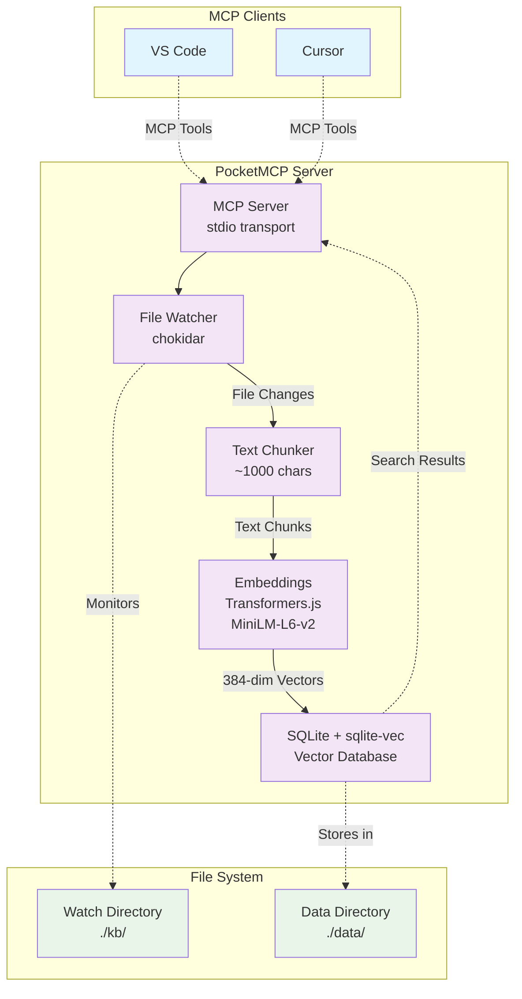

# PocketMCP

**PocketMCP** is a lightweight, local-first MCP (Model Context Protocol) server that automatically watches a folder, chunks and embeds files locally using Transformers.js with MiniLM, stores vectors in SQLite + sqlite-vec, and exposes semantic search capabilities to VS Code and Cursor. Designed for small machines (Intel N100, 16GB RAM) with zero external dependencies after initial model download.

## Architecture



## Features

- **🔍 Semantic Search**: Find content by meaning, not just keywords
- **📁 Auto-Ingestion**: Watches folders and automatically processes new/changed files
- **⚡ Local-First**: Runs completely offline after initial model download
- **🗄️ SQLite Storage**: Fast, reliable vector storage with sqlite-vec extension
- **🔧 MCP Integration**: Native support for VS Code and Cursor via MCP protocol
- **💾 Efficient**: Designed for resource-constrained environments
- **🔄 Real-time**: Debounced file watching with smart concurrency limits

## Quick Start

### 1. Installation

```bash
# Clone or download the project
cd PocketMCP

# Install dependencies
pnpm install

# Copy environment template
cp .env.example .env
```

### 2. Configuration

Edit `.env` file:

```bash
# SQLite database path
SQLITE_PATH=./data/index.db

# Directory to watch for file changes (optional)
WATCH_DIR=./kb

# Embedding model (default is recommended)
MODEL_ID=Xenova/all-MiniLM-L6-v2

# Chunking configuration
CHUNK_SIZE=1000
CHUNK_OVERLAP=120
```

### 3. Create Content Directory

```bash
# Create directory for your documents
mkdir -p kb

# Add some markdown or text files
echo "# My First Document" > kb/test.md
echo "This is a sample document for testing PocketMCP." >> kb/test.md
```

### 4. Start the Server

```bash
# Development mode (recommended for testing)
pnpm dev

# Or build and run production
pnpm build
pnpm start
```

On first run, the server will download the MiniLM model (~100MB) and then process any files in your watch directory.

## MCP Client Configuration

### Cursor Integration

1. Open **Cursor Settings** → **MCP**
2. Add a new server with these settings:

```json
{
  "command": "pnpm",
  "args": ["dev"],
  "cwd": "/path/to/PocketMCP",
  "env": {
    "SQLITE_PATH": "./data/index.db",
    "WATCH_DIR": "./kb",
    "MODEL_ID": "Xenova/all-MiniLM-L6-v2"
  }
}
```

### VS Code Integration

For VS Code clients that support MCP, add to your settings:

```json
{
  "mcpServers": {
    "pocketmcp": {
      "command": "pnpm",
      "args": ["dev"],
      "cwd": "/path/to/PocketMCP",
      "env": {
        "SQLITE_PATH": "./data/index.db",
        "WATCH_DIR": "./kb",
        "MODEL_ID": "Xenova/all-MiniLM-L6-v2"
      }
    }
  }
}
```

**Alternative: Direct Node Execution**

```json
{
  "command": "node",
  "args": ["dist/server.js"],
  "cwd": "/path/to/PocketMCP",
  "env": {
    "SQLITE_PATH": "./data/index.db",
    "WATCH_DIR": "./kb"
  }
}
```

## Available Tools

### `search`
Search for similar content using semantic search.

```json
{
  "query": "machine learning algorithms",
  "top_k": 5,
  "filter": {
    "doc_ids": ["doc_123", "doc_456"]
  }
}
```

### `upsert_documents`
Insert or update documents programmatically.

```json
{
  "docs": [
    {
      "text": "Your document content here...",
      "external_id": "my_doc_1",
      "title": "Important Notes",
      "metadata": {}
    }
  ]
}
```

### `delete_documents`
Delete documents by ID.

```json
{
  "doc_ids": ["doc_123"],
  "external_ids": ["my_doc_1"]
}
```

### `list_documents`
List all documents with pagination.

```json
{
  "page": {
    "limit": 20
  }
}
```

## Resources

PocketMCP also provides resource URIs for accessing specific chunks:

- **Format**: `mcp+doc://<doc_id>#<chunk_id>`
- **Returns**: Complete chunk data including text, offsets, and metadata

## Directory Structure

```
PocketMCP/
├── src/
│   ├── server.ts          # MCP server and main entry point
│   ├── db.ts              # SQLite database with sqlite-vec
│   ├── embeddings.ts      # Transformers.js embedding pipeline
│   ├── chunker.ts         # Text chunking with sentence awareness
│   ├── ingest.ts          # Generic document ingestion
│   ├── file-ingest.ts     # File-specific ingestion logic
│   └── watcher.ts         # File system watcher with debouncing
├── data/                  # SQLite database storage
├── kb/                    # Default watch directory (configurable)
├── .env                   # Environment configuration
└── README.md
```

## Configuration Options

### Environment Variables

| Variable | Default | Description |
|----------|---------|-------------|
| `SQLITE_PATH` | `./data/index.db` | Path to SQLite database file |
| `WATCH_DIR` | (none) | Directory to watch for file changes |
| `MODEL_ID` | `Xenova/all-MiniLM-L6-v2` | Hugging Face model for embeddings |
| `CHUNK_SIZE` | `1000` | Target chunk size in characters |
| `CHUNK_OVERLAP` | `120` | Overlap between chunks in characters |

### Watch Directory Notes

- **`WATCH_DIR` is optional** - if not set, only manual document upserts work
- **Choose any directory** - `./kb` is just a convention, use whatever makes sense
- **Supported files**: `.md`, `.txt` by default (configurable in code)
- **File filtering**: Automatically ignores temp files, `.DS_Store`, `node_modules`, etc.
- **Nested directories**: Recursively watches all subdirectories

### Supported File Types

Currently supports:
- **Markdown** (`.md`)
- **Plain text** (`.txt`)

To add more file types, modify the `supportedExtensions` in the `FileIngestManager` configuration.

## Performance & Limits

- **Sweet spot**: 10K-100K chunks on modest hardware
- **Query latency**: Sub-100ms for `top_k <= 10` on typical corpora
- **Memory usage**: ~100MB for model + minimal overhead per document
- **Concurrency**: Limited to 3 simultaneous file operations by default
- **File size limit**: 50MB per file (configurable)

## Development

```bash
# Install dependencies
pnpm install

# Run in development mode (hot reload)
pnpm dev

# Build for production
pnpm build

# Run production build
pnpm start

# Run with custom environment
WATCH_DIR=./my-docs CHUNK_SIZE=500 pnpm dev
```

## Troubleshooting

### Model Download Issues
If the embedding model fails to download:
- Check internet connection for initial download
- Model cache location: `~/.cache/huggingface/transformers/`
- Clear cache and retry if needed

### SQLite Extension Issues
If `sqlite-vec` fails to load:
- Ensure `sqlite-vec` npm package is installed
- Check that your system supports the required SQLite version
- On some systems, you may need to install SQLite development headers

### File Watching Issues
- **Files not being detected**: Check file extensions and ignore patterns
- **High CPU usage**: Increase debounce time with larger `debounceMs` values
- **Permission errors**: Ensure read/write access to watch and data directories

### Memory Issues
- Reduce `CHUNK_SIZE` for lower memory usage
- Process fewer files simultaneously by reducing `maxConcurrency`
- Consider using a smaller embedding model (though this requires code changes)

## License

MIT License - see LICENSE file for details.

## Contributing

1. Fork the repository
2. Create a feature branch
3. Make your changes
4. Add tests if applicable
5. Submit a pull request

## Acknowledgments

- **sqlite-vec** for fast vector similarity search
- **Transformers.js** for local embedding generation
- **Model Context Protocol** for standardized tool integration
- **Hugging Face** for the MiniLM model