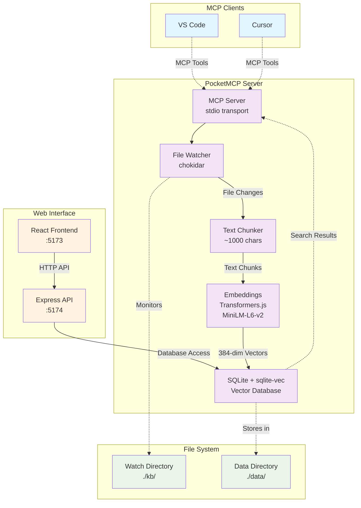

# PocketMCP

**PocketMCP** is a lightweight, local-first MCP (Model Context Protocol) server that automatically watches folders, chunks and embeds files locally using Transformers.js with MiniLM, stores vectors in SQLite + sqlite-vec, and exposes semantic search capabilities to VS Code and Cursor. Designed for small machines (I'm running on an Intel N100 with 16GB RAM) with zero external dependencies after initial model download.

## 🌟 Features

- **🔍 Semantic Search**: Find content by meaning, not just keywords
- **📁 Auto-Ingestion**: Watches folders and automatically processes new/changed files
- **⚡ Local-First**: Runs completely offline after initial model download
- **🗄️ SQLite Storage**: Fast, reliable vector storage with sqlite-vec extension
- **🔧 MCP Integration**: Native support for VS Code and Cursor via MCP protocol
- **🌐 Web Interface**: Built-in web tester for validation and manual testing
- **💾 Efficient**: Designed for resource-constrained environments
- **🔄 Real-time**: Debounced file watching with smart concurrency limits

## 📋 Table of Contents

- [Quick Start](#quick-start)
- [Web Tester](#web-tester)
- [MCP Client Integration](#mcp-client-integration)
- [API Reference](#api-reference)
- [Configuration](#configuration)
- [Development](#development)
- [Architecture](#architecture)
- [Troubleshooting](#troubleshooting)

## 🚀 Quick Start

### 1. Installation

```bash
# Clone or download the project
cd PocketMCP

# Install dependencies
pnpm install

# Setup environment
pnpm setup
# Or manually: cp .env.sample .env
```

### 2. Configuration

Edit `.env` file:

```bash
# SQLite database path
SQLITE_PATH=./data/index.db

# Directory to watch for file changes (optional)
WATCH_DIR=./kb

# Embedding model (default is recommended)
MODEL_ID=Xenova/all-MiniLM-L6-v2

# Chunking configuration
CHUNK_SIZE=1000
CHUNK_OVERLAP=120
```

### 3. Create Content Directory

```bash
# Create directory for your documents
mkdir -p kb

# Add some markdown or text files
echo "# My First Document" > kb/test.md
echo "This is a sample document for testing PocketMCP." >> kb/test.md
```

### 4. Start the Server

**Option A: MCP Server Only**

PocketMCP now supports multiple transport modes:

```bash
# Development - MCP server with both transports + file watching
pnpm dev:mcp

# Production - MCP server with both transports + file watching
pnpm build && pnpm start
```

**Transport Modes:**
- **`stdio`**: Standard MCP protocol over stdin/stdout (for VS Code, Cursor)
- **`http`**: Streamable HTTP transport with CORS support (for web clients, LAN access)
- **`both`**: Run both transports simultaneously (recommended for production)

**HTTP Transport Endpoints:**
- **MCP**: `http://0.0.0.0:8001/mcp` (Streamable HTTP MCP protocol)
- **Health**: `http://0.0.0.0:8001/health` (JSON health check)

**Environment Variables:**
- `TRANSPORT`: `stdio` | `http` | `both` (default: `both`)
- `HTTP_HOST`: HTTP bind address (default: `0.0.0.0`)
- `HTTP_PORT`: HTTP port (default: `8001`)
- `LOG_LEVEL`: `debug` | `info` | `warn` | `error` (default: `info`)

**Option B: Web Interface + API Server**
```bash
# Start web interface and API server for testing
pnpm dev
```

On first run, the server will download the MiniLM model (~100MB) and then process any files in your watch directory.

## 🌐 Web Tester

PocketMCP includes a comprehensive web interface for testing and validation.

### Access Points

- **Web Interface**: http://127.0.0.1:5173
- **API Server**: http://127.0.0.1:5174
- **Health Check**: http://127.0.0.1:5174/health

### Features

#### 📊 Database Diagnostics Panel
- Real-time database status monitoring
- Table counts and vector dimensions
- SQLite WAL mode verification
- Error detection and reporting
- One-click smoke testing

#### 🔍 Search Panel
- Interactive semantic search testing
- LIKE vs Vector search modes
- Configurable result count (top-K)
- Detailed result inspection
- Performance metrics (response time)

#### 📄 Documents Panel
- Browse all indexed documents
- Pagination support
- Document metadata display
- Creation and update timestamps

#### 🔎 Chunk Viewer
- Detailed chunk inspection modal
- Full text content display
- Metadata and offset information
- Copy-to-clipboard functionality

### API Endpoints

| Endpoint | Method | Description |
|----------|--------|-------------|
| `/health` | GET | Server health check |
| `/api/db/diag` | GET | Database diagnostics |
| `/api/search` | POST | Semantic search |
| `/api/chunk/:id` | GET | Get specific chunk |
| `/api/docs` | GET | List documents |

### Example API Usage

**Search Documents:**
```bash
curl -X POST http://127.0.0.1:5174/api/search \
  -H "Content-Type: application/json" \
  -d '{"query": "machine learning", "top_k": 5, "mode": "like"}'
```

**Get Diagnostics:**
```bash
curl http://127.0.0.1:5174/api/db/diag | jq .
```

## 🔧 MCP Client Integration

PocketMCP supports both **stdio** and **HTTP** transports for maximum compatibility.

### Option A: Stdio Transport (Recommended for Desktop Clients)

**Cursor Integration:**

1. Open **Cursor Settings** → **MCP**
2. Add a new server with these settings:

```json
{
  "command": "pnpm",
  "args": ["dev:mcp"],
  "cwd": "/path/to/PocketMCP",
  "env": {
    "TRANSPORT": "stdio",
    "SQLITE_PATH": "./data/index.db",
    "WATCH_DIR": "./kb",
    "MODEL_ID": "Xenova/all-MiniLM-L6-v2"
  }
}
```

**VS Code Integration:**

For VS Code clients that support MCP, add to your settings:

```json
{
  "mcpServers": {
    "pocketmcp": {
      "command": "pnpm",
      "args": ["dev:mcp"],
      "cwd": "/path/to/PocketMCP",
      "env": {
        "TRANSPORT": "stdio",
        "SQLITE_PATH": "./data/index.db",
        "WATCH_DIR": "./kb",
        "MODEL_ID": "Xenova/all-MiniLM-L6-v2"
      }
    }
  }
}
```

**Production: Direct Node Execution**

```json
{
  "command": "node",
  "args": ["dist/cli.js"],
  "cwd": "/path/to/PocketMCP",
  "env": {
    "TRANSPORT": "stdio",
    "SQLITE_PATH": "./data/index.db",
    "WATCH_DIR": "./kb"
  }
}
```

### Option B: HTTP Transport (For Web Clients & Remote Access)

**Start PocketMCP Server:**

First, start PocketMCP with HTTP transport enabled:

```bash
# Development
pnpm dev:mcp

# Or production
pnpm build && pnpm start

# Or HTTP only
TRANSPORT=http pnpm dev:mcp
```

**MCP Client Configuration (HTTP):**

For MCP clients that support HTTP transport, configure the connection:

```json
{
  "mcpServers": {
    "pocketmcp": {
      "transport": "http",
      "url": "http://localhost:8001/mcp",
      "headers": {
        "Content-Type": "application/json"
      }
    }
  }
}
```

**Web Client Integration:**

For web applications using MCP over HTTP:

```javascript
// Example: Connect to PocketMCP via HTTP
const mcpClient = new MCPClient({
  transport: 'http',
  url: 'http://localhost:8001/mcp',
  headers: {
    'Content-Type': 'application/json'
  }
});

// Initialize connection
await mcpClient.connect();

// Use MCP tools
const searchResults = await mcpClient.callTool('search', {
  query: 'machine learning',
  top_k: 5
});
```

**Remote/LAN Access:**

To access PocketMCP from other machines on your network:

```bash
# Start with network binding
HTTP_HOST=0.0.0.0 HTTP_PORT=8001 pnpm dev:mcp

# Then connect from other machines using your server's IP
# http://192.168.1.100:8001/mcp
```

**Health Check:**

Test the HTTP transport:

```bash
# Health check
curl http://localhost:8001/health

# Expected response
{"status":"ok","timestamp":"2024-01-01T00:00:00.000Z"}
```

## 📚 API Reference

### MCP Tools

#### `search`
Search for similar content using semantic search.

```json
{
  "query": "machine learning algorithms",
  "top_k": 5,
  "filter": {
    "doc_ids": ["doc_123", "doc_456"]
  }
}
```

#### `upsert_documents`
Insert or update documents programmatically.

```json
{
  "docs": [
    {
      "text": "Your document content here...",
      "external_id": "my_doc_1",
      "title": "Important Notes",
      "metadata": {}
    }
  ]
}
```

#### `delete_documents`
Delete documents by ID.

```json
{
  "doc_ids": ["doc_123"],
  "external_ids": ["my_doc_1"]
}
```

#### `list_documents`
List all documents with pagination.

```json
{
  "page": {
    "limit": 20
  }
}
```

### MCP Resources

PocketMCP provides resource URIs for accessing specific chunks:

- **Format**: `mcp+doc://<doc_id>#<chunk_id>`
- **Returns**: Complete chunk data including text, offsets, and metadata

## ⚙️ Configuration

### Environment Variables

| Variable | Default | Description |
|----------|---------|-------------|
| `SQLITE_PATH` | `./data/index.db` | Path to SQLite database file |
| `WATCH_DIR` | (none) | Directory to watch for file changes |
| `MODEL_ID` | `Xenova/all-MiniLM-L6-v2` | Hugging Face model for embeddings |
| `CHUNK_SIZE` | `1000` | Target chunk size in characters |
| `CHUNK_OVERLAP` | `120` | Overlap between chunks in characters |
| `NODE_ENV` | `development` | Environment mode |
| `VERBOSE_LOGGING` | `false` | Enable detailed logs |
| `DEBUG_DOTENV` | `false` | Enable dotenv debug output |
| `API_PORT` | `5174` | Web API server port |
| `API_BIND` | `127.0.0.1` | API server bind address |

### Available Scripts

| Script | Description |
|--------|-------------|
| `pnpm dev` | Start web interface + API server for testing |
| `pnpm dev:mcp` | Start MCP server (both transports + file watching) |
| `pnpm build` | Build all components |
| `pnpm start` | Start production MCP server (both transports + file watching) |
| `pnpm setup` | Create .env from template |
| `pnpm clean` | Clean build artifacts and database |

### Watch Directory Notes

- **`WATCH_DIR` is optional** - if not set, only manual document upserts work
- **Choose any directory** - `./kb` is just a convention, use whatever makes sense
- **Supported files**: `.md`, `.txt` by default (configurable in code)
- **File filtering**: Automatically ignores temp files, `.DS_Store`, `node_modules`, etc.
- **Nested directories**: Recursively watches all subdirectories

### Supported File Types

Currently supports:
- **Markdown** (`.md`)
- **Plain text** (`.txt`)

To add more file types, modify the `supportedExtensions` in the `FileIngestManager` configuration.

## 🛠️ Development

### Project Structure

```
PocketMCP/                    # Monorepo root
├── package.json             # Workspace configuration
├── pnpm-workspace.yaml      # pnpm workspace setup
├── .env                     # Environment variables
├── .env.sample              # Environment template
├── apps/
│   ├── api/                 # Express API server
│   │   ├── src/
│   │   │   ├── server.ts    # Main API server
│   │   │   └── db.ts        # Database manager
│   │   └── package.json
│   └── web/                 # React + Vite frontend
│       ├── src/
│       │   ├── App.tsx      # Main app component
│       │   ├── store.ts     # Zustand state management
│       │   ├── api.ts       # API client
│       │   └── components/  # UI components
│       └── package.json
├── src/                     # Original MCP server
│   ├── server.ts            # MCP server and main entry point
│   ├── db.ts                # SQLite database with sqlite-vec
│   ├── embeddings.ts        # Transformers.js embedding pipeline
│   ├── chunker.ts           # Text chunking with sentence awareness
│   ├── ingest.ts            # Generic document ingestion
│   ├── file-ingest.ts       # File-specific ingestion logic
│   └── watcher.ts           # File system watcher with debouncing
├── data/                    # SQLite database storage
├── kb/                      # Default watch directory (configurable)
└── README.md
```

### Development Commands

```bash
# Install dependencies
pnpm install

# Run MCP server in development mode (hot reload)
pnpm dev:mcp

# Run web tester in development mode
pnpm dev

# Build for production
pnpm build

# Run production build
pnpm start

# Run with custom environment
WATCH_DIR=./my-docs CHUNK_SIZE=500 pnpm dev:mcp
```

### Testing

```bash
# Test web tester functionality
./test-web-tester.sh

# Manual API testing
curl http://127.0.0.1:5174/health
curl http://127.0.0.1:5174/api/db/diag
```

## 🚀 Production Deployment

### Docker Deployment (Recommended)

PocketMCP is containerized and ready for production deployment with Docker and Portainer. The Docker setup runs all components together in a single container:

**🏗️ Multi-Service Architecture:**
- **MCP Server** (port 8001): HTTP transport for MCP protocol
- **API Server** (port 5174): Database operations and diagnostics  
- **Web UI** (port 5173): Interactive web interface for testing and management
- **Combined Health Check**: Monitors all services via `/health` endpoint

#### Quick Start with Docker

```bash
# Pull the latest image
docker pull ghcr.io/your-username/pocketmcp:latest

# Run with all services (MCP + API + Web UI)
docker run -d \
  --name pocketmcp \
  --restart unless-stopped \
  -p 8001:8001 \
  -p 5174:5174 \
  -p 5173:5173 \
  -v pocketmcp_data:/app/data \
  -v pocketmcp_kb:/app/kb \
  -v pocketmcp_cache:/app/.cache \
  ghcr.io/your-username/pocketmcp:latest
```

**Access Points:**
- **🔧 MCP Server**: `http://localhost:8001` (HTTP transport + health check)
- **📊 API Server**: `http://localhost:5174` (Database API + diagnostics)  
- **🌐 Web UI**: `http://localhost:5173` (Interactive web interface)
- **❤️ Health Check**: `http://localhost:5173/health` (Combined service status)

#### Docker Compose

```bash
# Clone the repository
git clone https://github.com/your-username/PocketMCP.git
cd PocketMCP

# Copy and customize environment file
cp .env.sample .env

# Start with Docker Compose
docker-compose up -d

# View logs
docker-compose logs -f pocketmcp

# Stop
docker-compose down
```

### Docker Operations

#### Building Images

**Local Build:**
```bash
# Build for current platform
docker build -t pocketmcp:local .

# Build multi-arch (requires buildx)
docker buildx build --platform linux/amd64,linux/arm64 -t pocketmcp:multi-arch .
```

**GitHub Actions Build:**
```bash
# Tag and push to trigger automated build
git tag v1.0.0
git push origin v1.0.0

# Manual trigger via GitHub Actions UI
# Go to Actions → Build and Release Docker Images → Run workflow
```

#### Image Registry

**GitHub Container Registry (GHCR):**
```bash
# Login to GHCR
echo $GITHUB_TOKEN | docker login ghcr.io -u USERNAME --password-stdin

# Tag for GHCR
docker tag pocketmcp:local ghcr.io/USERNAME/pocketmcp:v1.0.0

# Push to GHCR
docker push ghcr.io/USERNAME/pocketmcp:v1.0.0
```

#### Tag Strategy

| Tag Pattern | Purpose | Example | Recommended For |
|-------------|---------|---------|-----------------|
| `vX.Y.Z` | Exact version | `v1.2.3` | Production pinning |
| `vX.Y` | Minor stream | `v1.2` | Auto-updates within minor |
| `vX` | Major stream | `v1` | Auto-updates within major |
| `latest` | Latest release | `latest` | Development/testing |
| `main-SHA` | Commit-based | `main-a1b2c3d` | CI/CD pipelines |

**Portainer Tag Selection:**
- **Stable Production**: Use exact version tags (`v1.2.3`)
- **Auto-Updates**: Use minor version tags (`v1.2`) for automatic patch updates
- **Development**: Use `latest` for newest features

#### Volume Management

**Critical Volumes:**
```bash
# Database persistence (CRITICAL - contains all your data)
/app/data → SQLite database, must be backed up

# Knowledge base (your documents)
/app/kb → Source documents, can be repopulated

# Model cache (performance optimization)
/app/.cache → Downloaded models, can be recreated
```

**Backup Strategy:**
```bash
# Backup database
docker cp pocketmcp:/app/data/index.db ./backup-$(date +%Y%m%d).db

# Backup with Docker Compose
docker-compose exec pocketmcp cp /app/data/index.db /app/data/backup-$(date +%Y%m%d).db
```

### Portainer Setup

#### Container Creation

**Option 1: Portainer Stacks (Recommended)**

1. Go to **Stacks** → **Add stack**
2. Name: `pocketmcp`
3. Paste this docker-compose content:

```yaml
version: '3.8'
services:
  pocketmcp:
    image: ghcr.io/USERNAME/pocketmcp:v1.0
    container_name: pocketmcp
    restart: unless-stopped
    ports:
      - "8001:8001"  # MCP Server
      - "5174:5174"  # API Server  
      - "5173:5173"  # Web UI
    volumes:
      - pocketmcp_data:/app/data
      - pocketmcp_kb:/app/kb  
      - pocketmcp_cache:/app/.cache
    environment:
      - NODE_ENV=production
      - TRANSPORT=both
      - HTTP_HOST=0.0.0.0
      - HTTP_PORT=8001
      - API_PORT=5174
      - WEB_PORT=5173
      - LOG_LEVEL=info
      - SQLITE_PATH=/app/data/index.db
      - WATCH_DIR=/app/kb
      - MODEL_ID=Xenova/all-MiniLM-L6-v2
      - CHUNK_SIZE=1000
      - CHUNK_OVERLAP=120
      - VERBOSE_LOGGING=false
    healthcheck:
      test: ["CMD", "curl", "-f", "http://localhost:5173/health"]
      interval: 30s
      timeout: 10s
      retries: 3
      start_period: 60s

volumes:
  pocketmcp_data:
  pocketmcp_kb:
  pocketmcp_cache:
```

**Option 2: Individual Container**

1. Go to **Containers** → **Add container**
2. Fill in the configuration:

| Setting | Value |
|---------|-------|
| **Name** | `pocketmcp` |
| **Image** | `ghcr.io/USERNAME/pocketmcp:v1.0` |
| **Port mapping** | `8001:8001, 5174:5174, 5173:5173` |
| **Restart policy** | `Unless stopped` |

#### Environment Variables

| Variable | Default | Description |
|----------|---------|-------------|
| `NODE_ENV` | `production` | Runtime environment |
| `TRANSPORT` | `both` | MCP transport mode (`stdio`/`http`/`both`) |
| `HTTP_HOST` | `0.0.0.0` | HTTP server bind address |
| `HTTP_PORT` | `8001` | MCP server port |
| `API_PORT` | `5174` | Web API server port |
| `WEB_PORT` | `5173` | Web UI server port |
| `LOG_LEVEL` | `info` | Logging level (`debug`/`info`/`warn`/`error`) |
| `SQLITE_PATH` | `/app/data/index.db` | Database file path |
| `WATCH_DIR` | `/app/kb` | Directory to watch for changes |
| `MODEL_ID` | `Xenova/all-MiniLM-L6-v2` | Hugging Face embedding model |
| `CHUNK_SIZE` | `1000` | Text chunk size in characters |
| `CHUNK_OVERLAP` | `120` | Overlap between chunks |
| `MAX_CONCURRENT_FILES` | `5` | Max files processed simultaneously |
| `VERBOSE_LOGGING` | `false` | Enable detailed logging |
| `HF_TOKEN` | _(optional)_ | Hugging Face API token |
| `HF_CACHE_DIR` | `/app/.cache` | Model cache directory |

#### Volume Mappings

| Container Path | Purpose | Host Path Example | Required |
|----------------|---------|-------------------|----------|
| `/app/data` | **Database storage** | `/opt/pocketmcp/data` | **Yes** |
| `/app/kb` | **Knowledge base** | `/opt/pocketmcp/kb` | **Yes** |
| `/app/.cache` | **Model cache** | `/opt/pocketmcp/cache` | Recommended |

**Volume Setup in Portainer:**
1. **Volumes** tab → **Add volume**
2. Create three volumes:
   - `pocketmcp_data` (database)
   - `pocketmcp_kb` (documents)  
   - `pocketmcp_cache` (models)

#### Port Configuration

| Host Port | Container Port | Protocol | Purpose |
|-----------|----------------|----------|---------|
| `8001` | `8001` | TCP | MCP Server (HTTP transport) |
| `5174` | `5174` | TCP | Web API Server (database operations) |
| `5173` | `5173` | TCP | Web UI Server (interactive interface) |

#### Health Check Configuration

The container includes a built-in health check that monitors all services via the combined `/health` endpoint:

- **Test Command**: `curl -f http://localhost:5173/health`
- **Monitors**: MCP Server, API Server, and Web UI
- **Interval**: 30 seconds
- **Timeout**: 10 seconds  
- **Start Period**: 60 seconds (allows model download)
- **Retries**: 3

**Health Response Format:**
```json
{
  "status": "ok",
  "timestamp": "2024-01-01T00:00:00.000Z",
  "services": {
    "mcp": "ok",
    "api": "ok", 
    "web": "ok"
  }
}
```

#### Resource Limits (Recommended)

| Resource | Limit | Reservation |
|----------|-------|-------------|
| **Memory** | 2GB | 512MB |
| **CPU** | 1.0 cores | 0.25 cores |

#### Upgrading

**Rolling Updates:**
1. **Stacks**: Edit stack → Change image tag → **Update the stack**
2. **Containers**: **Recreate** container with new image tag

**Version Pinning vs Auto-Updates:**
- **Pin to exact version**: `ghcr.io/USERNAME/pocketmcp:v1.2.3`
- **Auto-update patches**: `ghcr.io/USERNAME/pocketmcp:v1.2`
- **Auto-update minor**: `ghcr.io/USERNAME/pocketmcp:v1`

#### Troubleshooting

**Container won't start:**
- Check logs in Portainer: **Containers** → **pocketmcp** → **Logs**
- Verify volume permissions
- Ensure ports aren't conflicting

**Health check failing:**
- Wait 60+ seconds for initial model download
- Check individual services:
  - MCP Server: `curl http://HOST_IP:8001/health`
  - API Server: `curl http://HOST_IP:5174/health`
  - Web UI: `curl http://HOST_IP:5173/health`
- Review container logs for specific service errors

**Performance issues:**
- Increase memory limit if model loading fails
- Reduce `CHUNK_SIZE` for lower memory usage
- Check disk space for volumes

### systemd Service (Linux)

Create `/etc/systemd/system/pocketmcp.service`:

```ini
[Unit]
Description=PocketMCP Server
After=network.target

[Service]
Type=simple
User=pocketmcp
WorkingDirectory=/opt/pocketmcp
Environment=NODE_ENV=production
Environment=TRANSPORT=both
Environment=HTTP_HOST=0.0.0.0
Environment=HTTP_PORT=8001
Environment=SQLITE_PATH=/opt/pocketmcp/data/index.db
Environment=WATCH_DIR=/opt/pocketmcp/kb
ExecStart=/usr/bin/node dist/cli.js
Restart=always
RestartSec=10
StandardOutput=journal
StandardError=journal

[Install]
WantedBy=multi-user.target
```

Enable and start:
```bash
sudo systemctl enable pocketmcp
sudo systemctl start pocketmcp
sudo systemctl status pocketmcp
```

### Docker Deployment

```dockerfile
FROM node:18-alpine

WORKDIR /app
COPY package*.json ./
RUN npm install --production

COPY dist/ ./dist/
COPY data/ ./data/
COPY kb/ ./kb/

EXPOSE 8000

ENV NODE_ENV=production
ENV TRANSPORT=both
ENV HTTP_HOST=0.0.0.0
ENV HTTP_PORT=8001

CMD ["node", "dist/cli.js"]
```

### Health Monitoring

```bash
# Health check endpoint
curl http://localhost:8001/health

# Expected response
{"status":"ok","timestamp":"2024-01-01T00:00:00.000Z"}

# Log monitoring
journalctl -u pocketmcp -f  # systemd
pm2 logs pocketmcp          # PM2
```

## 🏗️ Architecture



## 📊 Performance & Limits

- **Sweet spot**: 10K-100K chunks on modest hardware
- **Query latency**: Sub-100ms for `top_k <= 10` on typical corpora
- **Memory usage**: ~100MB for model + minimal overhead per document
- **Concurrency**: Limited to 3 simultaneous file operations by default
- **File size limit**: 50MB per file (configurable)

## 🔧 Troubleshooting

### Model Download Issues
If the embedding model fails to download:
- Check internet connection for initial download
- Model cache location: `~/.cache/huggingface/transformers/`
- Clear cache and retry if needed

### SQLite Extension Issues
If `sqlite-vec` fails to load:
- Ensure `sqlite-vec` npm package is installed
- Check that your system supports the required SQLite version
- The system automatically falls back to regular SQLite tables if vec0 virtual tables fail

### File Watching Issues
- **Files not being detected**: Check file extensions and ignore patterns
- **High CPU usage**: Increase debounce time with larger `debounceMs` values
- **Permission errors**: Ensure read/write access to watch and data directories

### Web Interface Issues
- **API not accessible**: Ensure API server is running on port 5174
- **Database not found**: Check `SQLITE_PATH` environment variable
- **CORS errors**: API server includes CORS headers for local development

### Memory Issues
- Reduce `CHUNK_SIZE` for lower memory usage
- Process fewer files simultaneously by reducing `maxConcurrency`
- Consider using a smaller embedding model (though this requires code changes)

### Common Error Messages

**"Too many parameter values were provided"**
- This was a known issue with sqlite-vec virtual tables, now fixed with automatic fallback

**"Failed to load sqlite-vec extension"**
- System automatically falls back to regular SQLite tables with JSON embeddings

**"Database file does not exist"**
- Run the MCP server first to create the database, or check the `SQLITE_PATH`

## ✅ Docker Deployment Verification

Use this checklist to verify your Docker deployment is working correctly:

### Pre-Deployment Checklist
- [ ] Docker and Docker Compose installed
- [ ] GitHub Container Registry access configured (if using GHCR)
- [ ] Sufficient disk space for volumes (minimum 2GB recommended)
- [ ] Port 8001 available on host system

### Build Verification
- [ ] Multi-arch image builds successfully for both linux/amd64 and linux/arm64
- [ ] GitHub Actions workflow completes without errors
- [ ] Image is published to container registry

### Runtime Verification
- [ ] Container starts successfully
- [ ] Health check endpoint returns `{"status":"ok"}` at `http://HOST:8001/health`
- [ ] Model files download and cache in `/app/.cache` volume
- [ ] Database initializes in `/app/data` volume
- [ ] File watching works when documents added to `/app/kb` volume

### Data Persistence Verification
- [ ] Database persists across container restarts
- [ ] Knowledge base files persist across container restarts  
- [ ] Model cache persists across container restarts (improves startup time)

### Portainer Integration Verification
- [ ] Container shows "healthy" status in Portainer
- [ ] Logs are accessible through Portainer interface
- [ ] Volume management works through Portainer
- [ ] Container can be upgraded by changing image tag

### Upgrade Verification
- [ ] Upgrading from `vX.Y.Z` to `vX.Y.(Z+1)` preserves all data
- [ ] Upgrading preserves knowledge base documents
- [ ] Health check passes after upgrade
- [ ] MCP functionality works after upgrade

### Performance Verification
- [ ] Memory usage stays within configured limits (default: 2GB max)
- [ ] CPU usage is reasonable during file processing
- [ ] Search queries respond within acceptable time (typically <100ms)
- [ ] File ingestion completes without timeout errors

## 📄 License

MIT License - see LICENSE file for details.

## 🤝 Contributing

1. Fork the repository
2. Create a feature branch
3. Make your changes
4. Add tests if applicable
5. Submit a pull request

## 🙏 Acknowledgments

- **sqlite-vec** for fast vector similarity search
- **Transformers.js** for local embedding generation
- **Model Context Protocol** for standardized tool integration
- **Hugging Face** for the MiniLM model
- **React + Vite** for the modern web interface
- **TailwindCSS** for beautiful, responsive styling